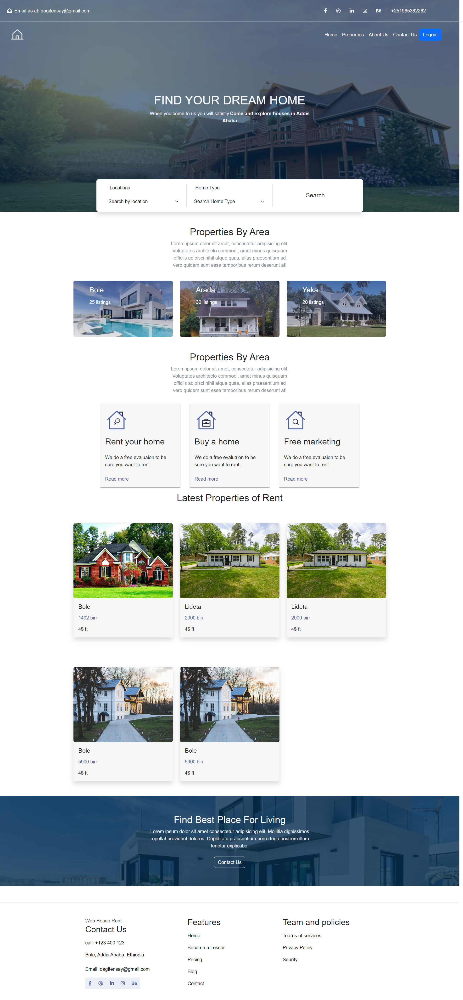
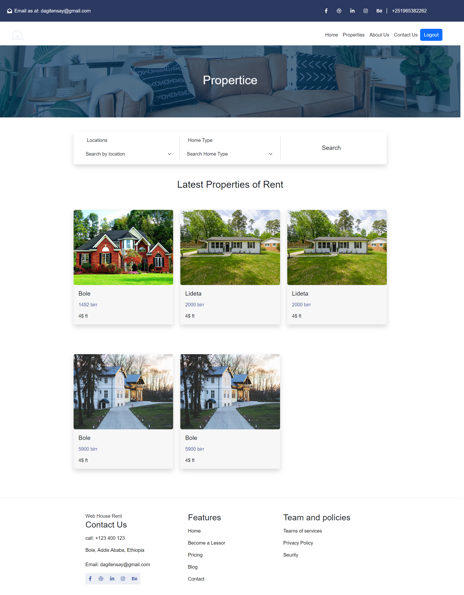
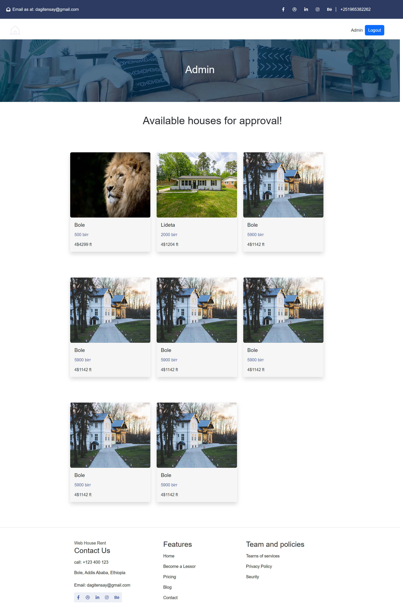
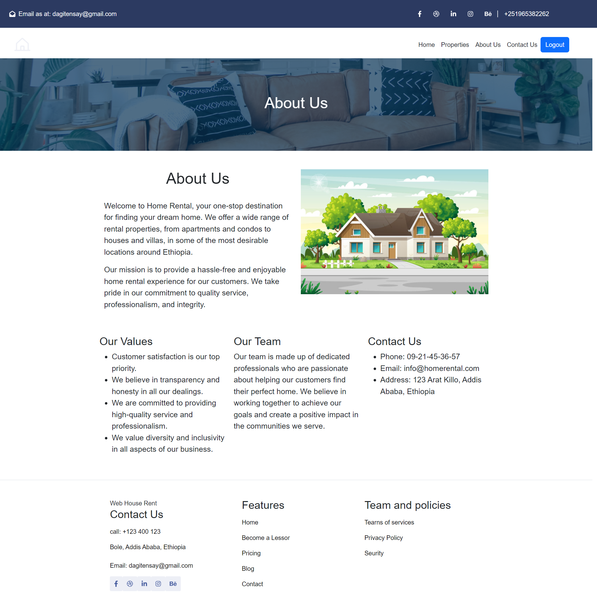

# Home Rental Web App



## Table of Contents

- [About](#about)
- [Features](#features)
- [Getting Started](#getting-started)
- [Prerequisites](#prerequisites)
- [Installation](#installation)
- [Usage](#usage)
- [Contributors](#contributing)
- [License](#license)

## About

This Home Rental Web App is a collaborative project developed as part of a class project at Addis Ababa University. It allows users to search, list, and manage rental properties, making it easy for both property owners and renters to connect. The project is built using React for the frontend and NestJS for the backend.

## Features

- User authentication and authorization
- Property search and listing
- Property details and image gallery
- User profiles and property management
- Admin panel for user and content management

## Getting Started

Follow these instructions to get a copy of the project up and running on your local machine for development and testing purposes.

Before you begin, make sure you have the following software and tools installed:

- [Node.js](https://nodejs.org/) - JavaScript runtime environment
- [npm](https://www.npmjs.com/) or [Yarn](https://yarnpkg.com/) - Package managers
- [MySql](https://www.mysql.com/) - MySQL database for storing application data

### Installation

1. Clone the repository:

   ```bash
   git clone https://github.com/your-username/home-rental-web-app.git

   ```

2. Navigate to the project directory:
   cd home-rental-web-app

3. Install dependencies on the backend:

   ```bash
   cd backend
   npm install
   npx primsa migrate

   ```

4. Install dependencies on the frontend:
   ```bash
   cd frontend
   npm install
   ```

### Usage

1.  Run the backend server

    ```bash
    npm run start

    ```

2.  Run the server:
    npm start

## Screenshots

- Properties
  
  
  
  
  

## Contributors

- Dagmawi Tensay (UGR/0443/13)
- Fasika Fikadu (UGR/9597/13)
- Kaleab Tibebe (UGR/2979/13)
- Deribew Shimels (UGR/5307/13)
- Ephrem Shimels (UGR/8099/13)
- Birhanu Asmamaw (UGR/2204/13)
- Nathnael Yimer (UGR/6855/13)
- Natnael Dejene (UGR/4254/13)
- Enyew Anberber (UGR/9324/13)

## 📝 License

Copyright © 2022 [Dagmawi Tensay](https://github.com/dagiTensay). <br />
This project is [MIT](https://github.com/dagiTensay/Home-Rental-system-web-app/blob/master/LICENSE) licensed.
